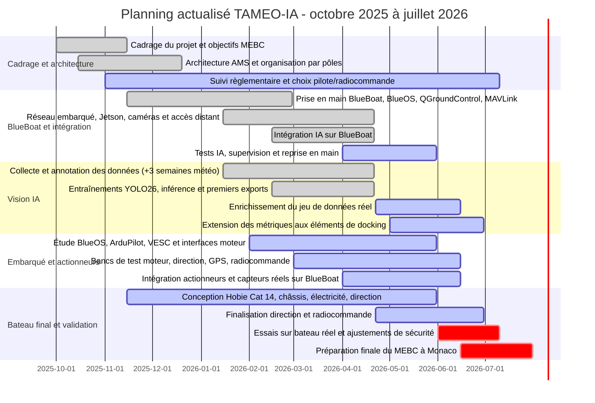

# Gantt actualisé du projet TAMEO-IA

Ce planning couvre la période d'octobre 2025 à juillet 2026. Il reprend l'état réel du projet au 21 avril 2026 d'après le dossier de réalisation, puis prolonge les tâches restantes en conservant le décalage de trois semaines identifié dans le rapport final pour la collecte de données et les phases d'intégration dépendantes.

Référence visuelle existante : `../img/Captura de tela 2026-04-10 141826.png`.

## Version compatible Markdown

Légende : `■` réalisé, `▣` en cours ou restant, `!` phase critique finale.

| Lot / tâche | Oct. 25 | Nov. 25 | Déc. 25 | Jan. 26 | Fév. 26 | Mars 26 | Avril 26 | Mai 26 | Juin 26 | Juil. 26 |
| --- | --- | --- | --- | --- | --- | --- | --- | --- | --- | --- |
| Cadrage du projet et objectifs MEBC | ■ | ■ |  |  |  |  |  |  |  |  |
| Architecture AMS et organisation par pôles | ■ | ■ | ■ |  |  |  |  |  |  |  |
| Suivi règlementaire et choix pilote/radiocommande |  | ▣ | ▣ | ▣ | ▣ | ▣ | ▣ | ▣ | ▣ | ▣ |
| Prise en main BlueBoat, BlueOS, QGroundControl, MAVLink |  | ■ | ■ | ■ | ■ |  |  |  |  |  |
| Réseau embarqué, Jetson, caméras et accès distant |  |  |  | ■ | ■ | ■ | ■ |  |  |  |
| Intégration IA sur BlueBoat |  |  |  |  | ■ | ■ | ■ |  |  |  |
| Tests IA, supervision et reprise en main |  |  |  |  |  |  | ▣ | ▣ |  |  |
| Collecte et annotation des données (+3 semaines météo) |  |  |  | ■ | ■ | ■ | ■ |  |  |  |
| Entraînements YOLO26, inférence et premiers exports |  |  |  |  | ■ | ■ | ■ |  |  |  |
| Enrichissement du jeu de données réel |  |  |  |  |  |  | ▣ | ▣ | ▣ |  |
| Extension des métriques aux éléments de docking |  |  |  |  |  |  |  | ▣ | ▣ |  |
| Étude BlueOS, ArduPilot, VESC et interfaces moteur |  |  |  |  | ▣ | ▣ | ▣ | ▣ |  |  |
| Bancs de test moteur, direction, GPS, radiocommande |  |  |  |  |  | ▣ | ▣ | ▣ | ▣ |  |
| Intégration actionneurs et capteurs réels sur BlueBoat |  |  |  |  |  |  | ▣ | ▣ | ▣ |  |
| Conception Hobie Cat 14, châssis, électricité, direction |  | ▣ | ▣ | ▣ | ▣ | ▣ | ▣ | ▣ |  |  |
| Finalisation direction et radiocommande |  |  |  |  |  |  | ▣ | ▣ | ▣ |  |
| Essais sur bateau réel et ajustements de sécurité |  |  |  |  |  |  |  |  | ! | ! |
| Préparation finale du MEBC à Monaco |  |  |  |  |  |  |  |  | ! | ! |

## Lecture du planning

| Période | État retenu | Justification |
| --- | --- | --- |
| Octobre 2025 - décembre 2025 | Cadrage, architecture et structuration des pôles | Mise en place du projet, définition de l'AMS et répartition Vision, Navigation, Simulation, Tests/Intégration et Conception. |
| Janvier 2026 - avril 2026 | Développement BlueBoat, Vision IA et intégration Jetson/caméras | Le dossier indique que l'environnement, la collecte/annotation, YOLO26, les premiers exports, le réseau BlueBoat, QGroundControl et MAVLink sont en place au 21 avril 2026. |
| Mars 2026 - juin 2026 | Décalage de trois semaines sur les données et l'intégration | Le rapport final mentionne un retard météo de trois semaines sur la collecte de données, avec impact sur le pipeline IA et les validations associées. |
| Avril 2026 - juin 2026 | Poursuite des bancs de test, VESC, actionneurs, capteurs, direction et radiocommande | Le dossier précise que ces intégrations sont engagées mais encore à finaliser avant les essais sur le bateau réel. |
| Juin 2026 - juillet 2026 | Essais réels, ajustements de sécurité et préparation Monaco | Les travaux restants portent sur la validation du comportement de direction, des commandes moteur, des communications et de la reprise en main. |

## Version Mermaid

